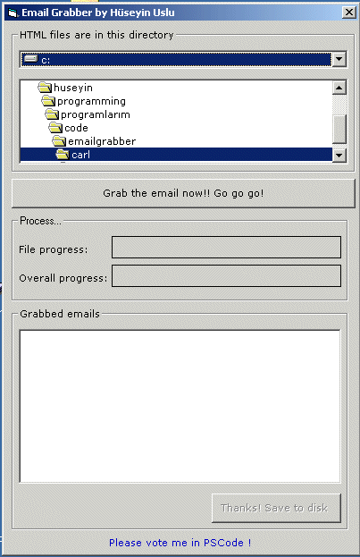



## Email Grabber

### Description

Let's say you have html , php , asp files that have email in. 

You want to get them but they are a lot of them. 

So?  

Use email grabber! 

It goes thgrough all files in a directory you selected and if they are .html and so , they look in to them for emails.  

The gathered email are then written to a file. 

It'll we usefull i think. 
 
### More Info
 

             |
---                |---
**Submitted On**   |2002-09-21 02:44:02
**By**             |[Huseyin  Uslu](https://github.com/Planet-Source-Code/PSCIndex/blob/master/ByAuthor/huseyin-uslu.md)
**Level**          |Intermediate
**User Rating**    |5.0 (10 globes from 2 users)
**Compatibility**  |VB 6\.0
**Category**       |[Internet/ HTML](https://github.com/Planet-Source-Code/PSCIndex/blob/master/ByCategory/internet-html__1-34.md)
**World**          |[Visual Basic](https://github.com/Planet-Source-Code/PSCIndex/blob/master/ByWorld/visual-basic.md)
**Archive File**   |[Email\_Grab1340559212002\.zip](https://github.com/Planet-Source-Code/huseyin-uslu-email-grabber__1-39156/archive/master.zip)

